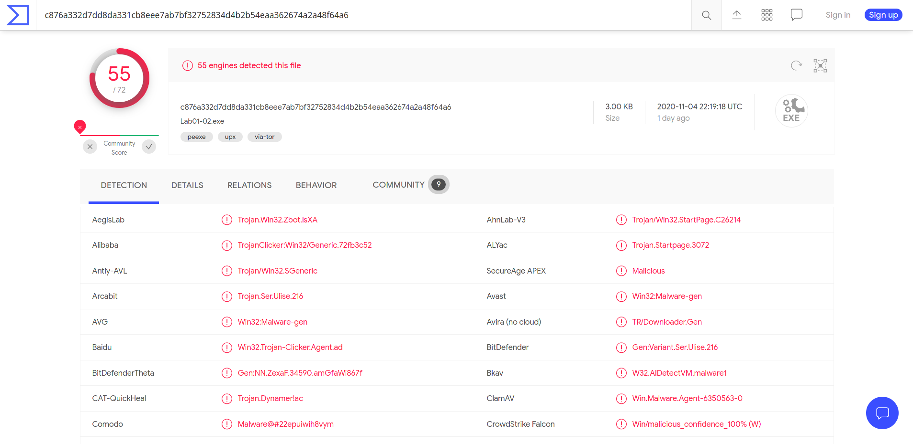
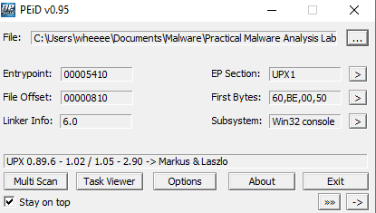
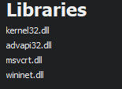
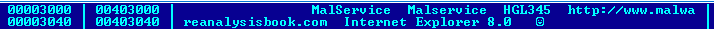
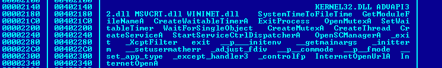

# Lab1-2

1. When I uploaded the file to VirusTotal, it was being flagged by 55 antivirus out of 72 as a trojan.
   
2. Based on VirusTotal, Lab1-02.exe is compiled on 19/1/2011.
   
   

3. When put into PEiD, it shows that the program is being packed by UPX, showing that the program is a packed malware.
 
   
4. Here are the imports for the exe:
   
   
    
   The exe imports:
   * KERNEL32.DLL, 
     * mainly used for file, memory and hardware manipulation
   * Advapi32.dll 
     * provides access to advanced core Windows components such as the Service Manager and Registry, 
   * msvcrt.dll  
     * ships in the standard C library functions  
   * wininet.dll
     * which allows the program to interact with http or ftp protocol to access network resources

5. Here are some strings found after unpacking the file
   
   

   

   Here, the function CreateServiceA is found, meaning that it is being used by the program. This means that a service will be started by the program when executed. Judging from the strings found, the service name seems to be "MalService". Hence, the host indicator will be to find whether if the service MalService is being started on the infected computer

6. From the strings found, WININET.dll seems to be used to access the url http://malwareanalysisbook.com. So a network based indicator will be to check for traffic accessing this site
7. Judging from all the collected information from this program, this program is probably backdoor which has a C2 server at http://malwareanalysisbook.com