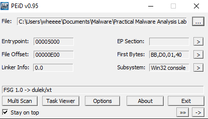

# Lab1-3
1. When uploaded to VirusTotal, 51 antivirus flagged the program as a trojan.
   
   

2. I cant find the compile time :(
3. When put into peid, it shows that the program is packed by FSG 1.0
    
    

4. The exe imports:
   
   

   * KERNEL32.DLL, 
     * mainly used for file, memory and hardware manipulation
     * in this case, LoadLibrary and GetProcAddress is used which are used commonly to unpack files
5,6,7. As the exe is now currently packed, nothing can be found about this executable

    

## Unpacking the exe
During this lab, I had to unpack the exe. Since this is the first time im unpacking FSG 1.0, imma document the steps here:
   1. Open the exe in Ollydbg and then go to Options -> Debugging Options -> SFX and select trace real entry of program
      
      

   2. Then, go to plugins -> OllyDump -> Find OEP by section hop (trace over) to find the original entry point of the exe
      
      

   3. After that, dump the thing with OllyDump and hola, the program is unpacked!
      
      

Continuing from here:

4. The exe imports:

   * msvcrt.dll  
     * ships in the standard C library functions 
   * OLE32.dll
     * Mainly used for data transfer and communicates with a remote server using RPC

5. This url is being found on the program
   
    

    judging from the url name, it can be assumed it is a advertisement from a website. Hence a good host indicator will be a internet browser popping out of nowhere to show an advertisement

6. Based on the last qn, a good network based indicator will be checking for network traffic between the host and http://malwareanalysisbook.com/ad.html
7. Based on the things found, this program is probably an adware

