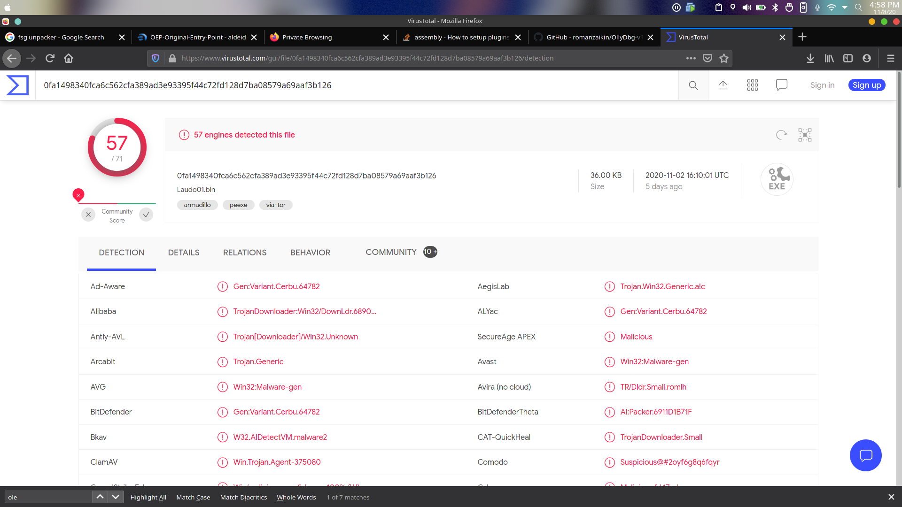
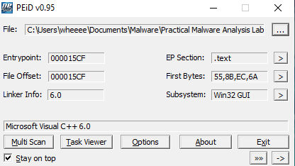
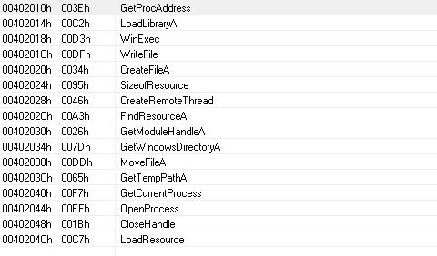
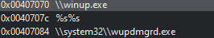

# Lab1-04
1. When uploaded to VirusTotal it is flagged by 57 antivirus as a trojan
   
   
2. This file is compiled on 2019:08:30 22:26:59. However, it is first seen in 2011 according to VirusTotal. Hence the compile time is probably fake
   
   

3. Based on peid, the program is compiled using Microsoft Visual C++. Hence it is not packed
   
   

4. Here are the imports for the exe:
   
   
    
   The exe imports:
   * KERNEL32.DLL, 
     * mainly used for file, memory and hardware manipulation
     * Here, WriteFile, CreateFile, MoveFile are used. This means that the program creates a file on the system
     * 
   * Advapi32.dll 
     * provides access to advanced core Windows components such as the Service Manager and Registry, 
     * Here, AdjustTokenPriveilages is used. The program probably uses this to change the permissions of the file created.
   * msvcrt.dll  
     * ships in the standard C library functions 

5. These strings are found on the program:
    
    

    These looks like file paths. Hence a good host based indicator will be finding these files on the infected computer

6. An url called "http://www.practicalmalwareanalysis.com/updater.exe" is found in the program.Hence a good network based indicator is to find network traffic to this url
7. Judging from the information collected, this program probably downloads a malicious file from a website which acts as backdoor on the system.