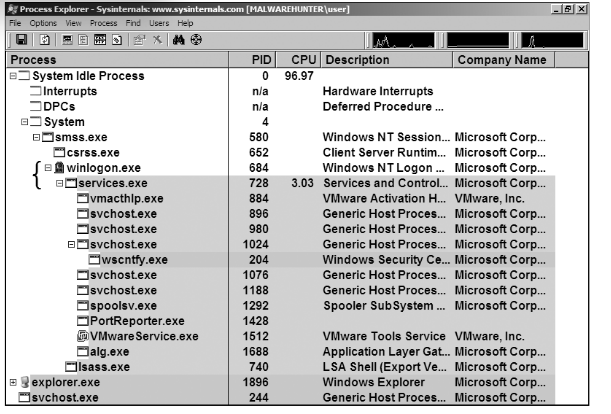

# Chapter 3: Basic Dynamic Analysis
<br>

**Dynamic Analysis** : Any examination performed after executing malware. 

## Sandbox 
* Security Mechanism for running untrusted programs in a safe environement 
* Comprises of virtualized environments that often simulate network services in some fashion to ensure that the software of malaare being tested will function normally 
* ### Malware Sandboxes
  * Examples include:
    * Norman SandBox and GFI SandBox
  * Provide easy to understand output
  * Great for initial triage 
  * Can choose to submit malware or not to a public website
* ### Drawbacks
  * Sandboxes usually runs executbale without commandline options
    * If malware needs the options, it will not be executed if run through a sandbox
  * If backdoor is present in the malware, it will not be run in the sandbox.
  * Not all events will be recorded if the malware executes for a long time as sandbox might not wait long enough for the events to trigger.
    * If sleep is tiggered, the sandbox might miss the event
  * If sandbox does not take into account that malware might detect it is running in a virtual machine, the malware might actually not run correctly
  * Some malware requires the presence of certain registry keys/files on the system which might contain commands and encryption keys and some sandboxes do not have them
  * Some DLLs' exported functions will not be invoked properly
  * OS environment of the sandbox might be incorrect
    * Win 7 vs Win XP
  * Sandbox cannot tell what a malware does. Need to interpret from the information provided by the sandbox 

## Running Malware
* exe files can be run by double clicking it. However, DLLs can be tricky as Windows does not know how to run them automatically. 
* rundll32.exe can be used from the command line to run dlls
* Run by exports
  * ```C:\rundll32.exe DLLname, Export arguments```
* Run by ordinal numbers
  * ```C:\rundll32.exe DLLname, Ordinal number```
* Install service in a DLL
  * ```C:\rundll32.exe DLLname, InstallService ServiceName```
  * ```C:\>net startServiceName```
  * However sometimes there are no exported functions for installing the service.
    * Need install manually by using sc command/modifying registry for an unused service and then use net start
      * Registry is at HKLM\SYSTEM\CurrentControlSet\Services
* DLLs can also be run by changing it as a exe through modifying the PE header
  * Wipe IMAGE_FILE_DLL(0x2000) flag from the Characteristics field in the IMAGE_FILE_HEADER.
  * Might cause dll to crash but it is possible to extract informaion

## Monitoring with Process Monitor 
* Procmon is an advanced monitoring tool for Windows
  * Can monitor registry,file system, network, process and thread activity
* Does not capture everything, however
  * Can miss device driver activity of a user-mode component talking to a rootkit via device I/O controls as well as certain GUI calls
  * Should not be ued to log network activity
    * Does not work consistently across different Windows versions
* Procmon monitors all system calls it can gather once executed
  * Due to large number of system calls in a Windows machine, vm might crash after running out of RAM. 
  * Clear all captured events before running subject malware to remove irrelevant data
* ### Procmon Display
  * Procmon displays configurable columns which includes
    * Event sequence number
    * timestamp
    * name of the process causing the event
    * path used by the event
    * result of the event
  * 
*  ### Filtering in Procmon
   *  Can set procmon to filter on one executable running on the system
   *  How to set filter
      1. Select a column to filter
         1. Process name
         2. Operation
         3. Detail
      2. Comparator
         1. Is
         2. Contains
         3. Less Than
      3. Include/Exclude
    * 
    * Can stack filters on top of each other
      * Click add to apply a new filter and then apply
    * Procmon also provides automatic filters 
      * Registry
        * Examining registry helps to tell how a malware installed itself in the registry
      * File system
        * Can show all files that malware creates or configuration files it uses
      * Process activity 
        * Can tell whether the malware spawned additional processes
      * Network
        * Can show any ports on which the malware is listening
      * 

## Viewing Processes with Process Explorer
* An powerful task manager
* Can provide valuable insight currently running on a system
* Should be running while running analysis
* Can list 
  * Active processes
  * DLLs loaded by a process
  * Various process properties
  * Overall system information
* Can:
  * Kill a process
  * Log out users
  * lanuch and validate processes
* ### Process Explorer Display
  * Displays processes running on a system and shows them in a tree structure that displays child and parent relationships
  * Five columns
    * Process name
    * Process identifier
    * CPU usage
    * Description
    * Company Name
  * Updaes every second
  * Services is pink
  * Processes in blue
  * New processes in green
  * Terminated proceses in red
    * Green and red highlights are temporary
  * When analyzing malware, watch out for changes/new processes and investigate them thoroughly
  * 
  * Can display information for each process
    * Can display file handles, mutexes, events and a lot more for DLLs loaded into memory
    * Can display all active threads and active connectons/ports on which the process is listening and path on the disk to the executable
* Can use verify option to ensure that the image on disk is a Microsoft signed binary
  * Can ensure file on disk is not corrupted
  * However it is useless when malware overwrite the executable's memory space with a malicious executable 
    * Provides same priveilages as the program that is replaced
    * Image in memory will be different then image on disk but verify only verifies image on disk and not the memory.
    * A good way to verify will be to use the Strings tab on the process properties window.
      * Strings inside the image will differ from the memory if process replacement happened
  * ### Using Dependancy Walker
    * Can launch Dependancy Walker on a running process
    * Can also search for a handle/DLL
      * Useful when a malicious DLL is found on disk and want to find out if that DLL is being used by any other processes
    * Can compare DLL list in Process Explorer to the imports shown in Dependency Walker
  * ### Analyzing Malicious Documents
    * When analyzing word documents and PDFs, can use Process Explorer to open the document and check whether if it launch any processes which can be seen in Process Explorer and track down the path of the malware