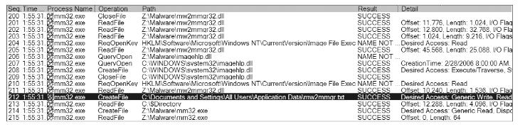
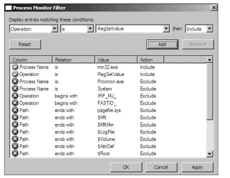
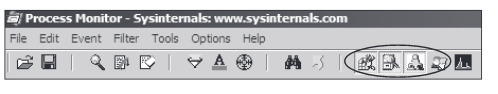

# Chapter 3: Basic Dynamic Analysis
<br>

**Dynamic Analysis** : Any examination performed after executing malware. 

## Sandbox 
* Security Mechanism for running untrusted programs in a safe environement 
* Comprises of virtualized environments that often simulate network services in some fashion to ensure that the software of malaare being tested will function normally 
* ### Malware Sandboxes
  * Examples include:
    * Norman SandBox and GFI SandBox
  * Provide easy to understand output
  * Great for initial triage 
  * Can choose to submit malware or not to a public website
* ### Drawbacks
  * Sandboxes usually runs executbale without commandline options
    * If malware needs the options, it will not be executed if run through a sandbox
  * If backdoor is present in the malware, it will not be run in the sandbox.
  * Not all events will be recorded if the malware executes for a long time as sandbox might not wait long enough for the events to trigger.
    * If sleep is tiggered, the sandbox might miss the event
  * If sandbox does not take into account that malware might detect it is running in a virtual machine, the malware might actually not run correctly
  * Some malware requires the presence of certain registry keys/files on the system which might contain commands and encryption keys and some sandboxes do not have them
  * Some DLLs' exported functions will not be invoked properly
  * OS environment of the sandbox might be incorrect
    * Win 7 vs Win XP
  * Sandbox cannot tell what a malware does. Need to interpret from the information provided by the sandbox 

## Running Malware
* exe files can be run by double clicking it. However, DLLs can be tricky as Windows does not know how to run them automatically. 
* rundll32.exe can be used from the command line to run dlls
* Run by exports
  * ```C:\rundll32.exe DLLname, Export arguments```
* Run by ordinal numbers
  * ```C:\rundll32.exe DLLname, Ordinal number```
* Install service in a DLL
  * ```C:\rundll32.exe DLLname, InstallService ServiceName```
  * ```C:\>net startServiceName```
  * However sometimes there are no exported functions for installing the service.
    * Need install manually by using sc command/modifying registry for an unused service and then use net start
      * Registry is at HKLM\SYSTEM\CurrentControlSet\Services
* DLLs can also be run by changing it as a exe through modifying the PE header
  * Wipe IMAGE_FILE_DLL(0x2000) flag from the Characteristics field in the IMAGE_FILE_HEADER.
  * Might cause dll to crash but it is possible to extract informaion

## Monitoring with Process Monitor 
* Procmon is an advanced monitoring tool for Windows
  * Can monitor registry,file system, network, process and thread activity
* Does not capture everything, however
  * Can miss device driver activity of a user-mode component talking to a rootkit via device I/O controls as well as certain GUI calls
  * Should not be ued to log network activity
    * Does not work consistently across different Windows versions
* Procmon monitors all system calls it can gather once executed
  * Due to large number of system calls in a Windows machine, vm might crash after running out of RAM. 
  * Clear all captured events before running subject malware to remove irrelevant data
* ### Procmon Display
  * Procmon displays configurable columns which includes
    * Event sequence number
    * timestamp
    * name of the process causing the event
    * path used by the event
    * result of the event
  * 
*  ### Filtering in Procmon
   *  Can set procmon to filter on one executable running on the system
   *  How to set filter
      1. Select a column to filter
         1. Process name
         2. Operation
         3. Detail
      2. Comparator
         1. Is
         2. Contains
         3. Less Than
      3. Include/Exclude
    * 
    * Can stack filters on top of each other
      * Click add to apply a new filter and then apply
    * Procmon also provides automatic filters 
      * Registry
        * Examining registry helps to tell how a malware installed itself in the registry
      * File system
        * Can show all files that malware creates or configuration files it uses
      * Process activity 
        * Can tell whether the malware spawned additional processes
      * Network
        * Can show any ports on which the malware is listening
      * 