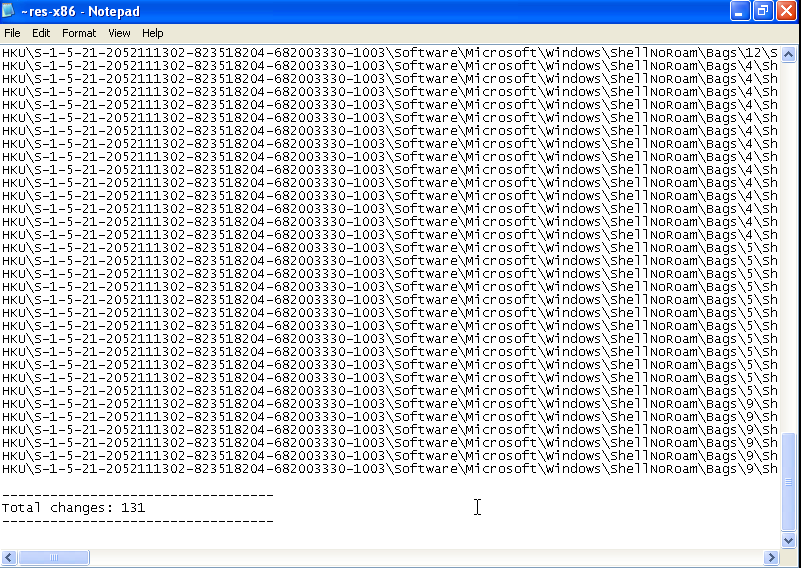

# Lab 3-1
1. When placed into cutter, it shows that the program imports kernel32.dll. However as the program is packed with PEncrypt3.1, I believe that the program is packed and there should be more imports then listed. As for strings, some of the more interesting ones include 
   *  www.practicalmalwareanalysis.com
      *  Probably a url which the malware tries to access
   *  SOFTWARE\\Microsoft\\Windows\\CurrentVersion\\Explorer\\Shell Folders, SOFTWARE\\Microsoft\\Windows\\CurrentVersion\\Run, Software\\Microsoft\\Active Setup\\Installed Components\\ and SOFTWARE\\Classes\\http\\shell\\open\\commandV
      *  This strings look like registry values and since advapi is also found, in the program. The malware tries to access these registry values to modify them.
   *  ws2_32 
      *  This dll is probably imported by the unpacked malware which will allow the program to access the internet
   *  CONNECT %s:%i HTTP/1.0\r\n\r\n
      *  Looks like a way to connect to a url using http
   *  
   *  
2. ### **Windows 10** 
   * When monitoring process created by this prorgam in Windows 10, Windows Error reporting pop up, meaning that this program is not compatible on Windows 10 and an older os might be needed to run the executable. So we will now try it on a Windows XP VM 
   * 
   ### **Windows XP**
   * When ran on Widnows XP, the program finally worked. Here are the things it done on the host:
     * When I used regshot to compare the registry before and after running the program, there are a lot of changes made to the registry
       * 
       * However this is the only one worth noting which is a addition of a VideoDriver value under Run which basically request the program to be started after startup:
         * 
   * When shown in process explorer, here is the program:
     * 
     * Here it shows that the program is a mutex which is a way for malware to prevent itself from infecting a system twice. Here the mutex name is  WinVMX32 which presence will be a good indicator of infection
   * Process explorer shows that this file creates an exe called vmx32to64.exe in System32 
     * 
     * 
3. At my DNS server, a request for the address www.practicalmalwareanalysis.com has been requested by the program. Hence a good network indicator will be to check for traffic between the host and this address.
   * 