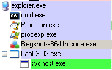

# Lab3-03
I placed the program through peid and found out that the malware is compied using Microsoft Visual C++, implying that it is not packed.


The program imports only kernel32.dll which implies that there might be file, memory and hardware manipulation done by this program

Here are the useful strings in the program
```
!This program cannot be run in DOS mode.
Rich
.text
`.rdata
@.data
.rsrc
runtime error 
TLOSS error
SING error
DOMAIN error
R6028
- unable to initialize heap
R6027
- not enough space for lowio initialization
R6026
- not enough space for stdio initialization
R6025
- pure virtual function call
R6024
- not enough space for _onexit/atexit table
R6019
- unable to open console device
R6018
- unexpected heap error
R6017
- unexpected multithread lock error
R6016
- not enough space for thread data
abnormal program termination
R6009
- not enough space for environment
R6008
- not enough space for arguments
R6002
- floating point not loaded
Microsoft Visual C++ Runtime Library
Runtime Error!
Program: 
<program name unknown>
GetLastActivePopup
GetActiveWindow
MessageBoxA
user32.dll
CloseHandle
VirtualFree
ReadFile
VirtualAlloc
GetFileSize
CreateFileA
ResumeThread
SetThreadContext
WriteProcessMemory
VirtualAllocEx
GetProcAddress
GetModuleHandleA
ReadProcessMemory
GetThreadContext
CreateProcessA
FreeResource
SizeofResource
LockResource
LoadResource
FindResourceA
GetSystemDirectoryA
Sleep
KERNEL32.dll
GetCommandLineA
GetVersion
ExitProcess
TerminateProcess
GetCurrentProcess
UnhandledExceptionFilter
GetModuleFileNameA
FreeEnvironmentStringsA
FreeEnvironmentStringsW
WideCharToMultiByte
GetEnvironmentStrings
GetEnvironmentStringsW
SetHandleCount
GetStdHandle
GetFileType
GetStartupInfoA
HeapDestroy
HeapCreate
HeapFree
RtlUnwind
WriteFile
HeapAlloc
GetCPInfo
GetACP
GetOEMCP
HeapReAlloc
LoadLibraryA
MultiByteToWideChar
LCMapStringA
LCMapStringW
GetStringTypeA
GetStringTypeW
\svchost.exe
NtUnmapViewOfSection
ntdll.dll
UNICODE
LOCALIZATION
```

From the strings, it can be implied that some memory modification will be involved as ReadProcessMemory and WriteProcessMemory are included within the strings. Also, a process might be started by this program due to the presence of CreateProcessA. Judging from it, svchost.exe will be started by the program.

1. When monitoring the program with process explorer, the program spawned svchost.exe. After that, lab3-03.exe disappeared and then svchost became the main program.




2. When looking through the strings in svchost.exe that replaced lab3-03.exe, I realised that the strings in the image is different from the one loaded in memory, making it look like a memory modification done by the program. Inside the fake strings, SetWindowsHooKExA was found, implying that there might be keyloggers involved in the malware
   

    Difference in strings between image and memory

   

   Suspicious looking strings

3. Within Procmon, I found a file that is being written called practicalmalwareanalysis.log in the same directory of the malware. When opened it is obvious it is a keylogger which contains which key is being written in each window.


4. The program is a keylogger but it is suspicious as it does not send any info to a C2 server.