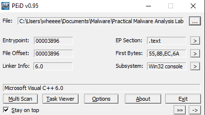
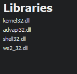
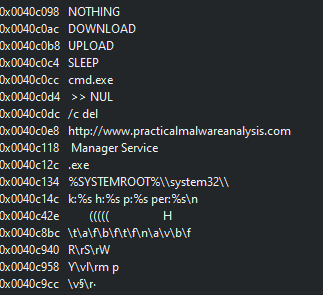
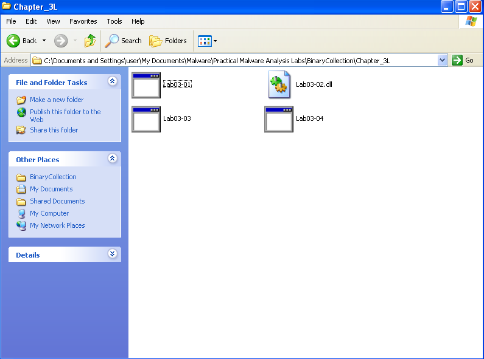
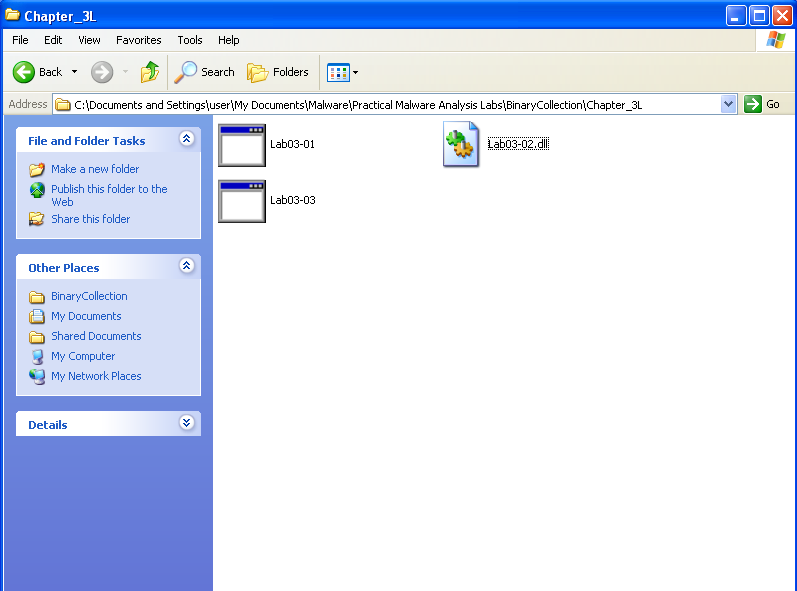
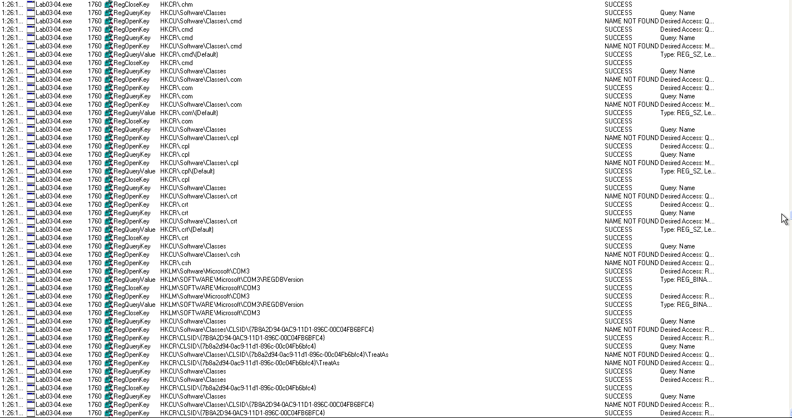

# Lab3-04
Before starting the lab, here is a basic static analysis of the program:

The program is compiled using Microsoft Visual C++, implying that the program is not being packed, allowing us to view the source code without doing additional work.

The program imports kernel32.dll,advapi.dll,shell.dll,ws2_32.dll. So I can be expecting file,memory and hardware manipulation, regsitry adding, reading and modifying, shell commands to be used and network traffic coming from this program.

Here are the interesting strings found in the program

cmd.exe /c del was found which probably the malware calls to delete a certain file using command prompt

http://www.practicalmalwareanalysis.com is probably an url that the program tries to connect to, using DOWNLOAD and UPLOAD as commands

Manager Service seems like a service name that the program uses and it is called when the program runs

1. Upon running the app, a command prompt console opens up, and after disappearing, the program deletes itself

 

2. When monitoring the program using procmon, I found out that the program is looping through all of the registry values stored in the computer. I am guessing that the program is reading the registry to determine whether the machine it is running on is a VM.

3. Here are some ways to run the malware 
* Bypass the checks of the program with a debugger
* Patch the program to remove the checks.
