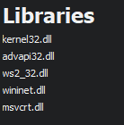
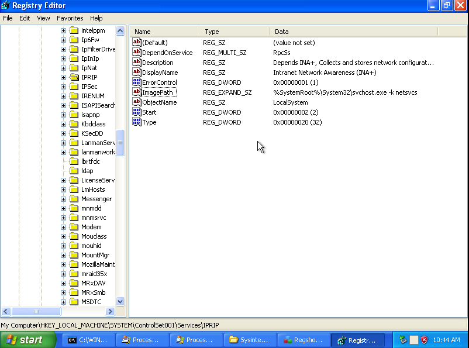
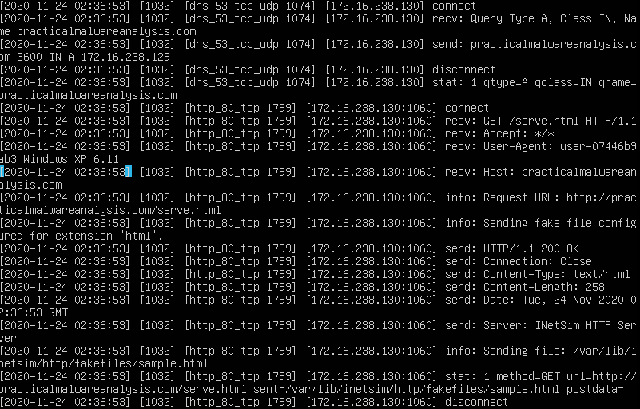

# Lab3-02

1. The program imports a number of libraries which include:
   *  kernel32.dll
   *  advapi32.dll
   *  ws2_32.dll
   *  wininet.dll
   *  msvcrt.dll
from the imports, it can be deduced that the program will mess with the registry, manipulate files or memory in the host and connect to the internet.



Here are the list of strings found in the program.
```
!This program cannot be run in DOS mode.
Rich
.text
`.rdata
@.data
.reloc
QQSUVW3
Hu4S
PSUV
j@SU
D$ 3
|$%Y
D$$SPh
t%HHt
D$ P
D$$h
D$ P
PhDa
SSSSh
tNSh
Qh4a
SSSSP
_WSP
QSSSSSS
F;5p
SVW3
PhDa
SSSj
Ph~f
SVWjJ3
SPSS
tFSh
VSh0
SSSPS
u(hta
uZh`a
PSSj
SPSS
_^[t
SVWj
PhDa
SSSSh
Ph4a
SSSSW
QVPW
j@VV
UUUUh
QQjPh(`
OQQQQP
Pj@h
_^][
PShxd
SSSSSh
SPSj
SPS3
ShTb
PhHb
@Y@PWj
VHtHHt3Ht
Hu_3
t       WVS
NWVS
u7WPS
u&WVS
_^[]
GetModuleFileNameA
Sleep
TerminateThread
WaitForSingleObject
GetSystemTime
CreateThread
GetProcAddress
LoadLibraryA
GetLongPathNameA
GetTempPathA
ReadFile
CloseHandle
CreateProcessA
GetStartupInfoA
CreatePipe
GetCurrentDirectoryA
GetLastError
lstrlenA
SetLastError
OutputDebugStringA
KERNEL32.dll
RegisterServiceCtrlHandlerA
RegSetValueExA
RegCreateKeyA
CloseServiceHandle
CreateServiceA
OpenSCManagerA
RegCloseKey
RegQueryValueExA
RegOpenKeyExA
DeleteService
OpenServiceA
SetServiceStatus
ADVAPI32.dll
WSASocketA
WS2_32.dll
InternetReadFile
HttpQueryInfoA
HttpSendRequestA
HttpOpenRequestA
InternetConnectA
InternetOpenA
InternetCloseHandle
WININET.dll
memset
wcstombs
strncpy
strcat
strcpy
atoi
fclose
fflush
??3@YAXPAX@Z
fwrite
fopen
strrchr
??2@YAPAXI@Z
atol
sscanf
strlen
strncat
strstr
_itoa
strchr
__CxxFrameHandler
_EH_prolog
_CxxThrowException
_except_handler3
MSVCRT.dll
??1type_info@@UAE@XZ
free
_initterm
malloc
_adjust_fdiv
_strnicmp
_chdir
_stricmp
Lab03-02.dll
Install
ServiceMain
UninstallService
installA
uninstallA
Y29ubmVjdA==
practicalmalwareanalysis.com
serve.html
dW5zdXBwb3J0
c2xlZXA=
Y21k
cXVpdA==
 Windows XP 6.11
CreateProcessA
kernel32.dll
.exe
HTTP/1.1
%s %s
1234567890123456
quit
exit
getfile
cmd.exe /c 
ABCDEFGHIJKLMNOPQRSTUVWXYZabcdefghijklmnopqrstuvwxyz0123456789+/
.PAX
.PAD
DependOnService
RpcSs
ServiceDll
GetModuleFileName() get dll path
Parameters
Type
Start
ObjectName
LocalSystem
ErrorControl
DisplayName
Description
Depends INA+, Collects and stores network configuration and location information, and notifies applications when this information changes.
ImagePath
%SystemRoot%\System32\svchost.exe -k 
SYSTEM\CurrentControlSet\Services\
CreateService(%s) error %d
Intranet Network Awareness (INA+)
%SystemRoot%\System32\svchost.exe -k netsvcs
OpenSCManager()
You specify service name not in Svchost//netsvcs, must be one of following:
RegQueryValueEx(Svchost\netsvcs)
netsvcs
RegOpenKeyEx(%s) KEY_QUERY_VALUE success.
RegOpenKeyEx(%s) KEY_QUERY_VALUE error .
SOFTWARE\Microsoft\Windows NT\CurrentVersion\Svchost
IPRIP
uninstall success
OpenService(%s) error 2
OpenService(%s) error 1
uninstall is starting
.?AVtype_info@@
080@0^0m0r0
1,131D1S1e1n1
2+2:2A2R2r2{2
3;3B3T3[3
4$4W4b4|4
676D6P6]6r6|6
7"7,797D7]7p7w7
8)868B8O8d8n8
9+969O9b9i9v9
:$:2:K:U:\:l:
;";7;A;Q;^;e;x;
<)<9<C<S<e<x<
=*=7=A=Q=c=q=
>(>/>B>Q>_>t>~>
?-???M?b?l?~?
0-0;0P0Z0l0z0
1)1>1H1U1`1y1
2)202?2J2]2j2w2
4!4:4A4Q4_4t4{4
5 505:5E5o5x5
60676G6U6j6q6~6
7&707;7]7f7v7
8&848N8X8h8r8
9*959O9Y9i9s9
:+:6:P:Z:j:t:
;,;7;Q;[;k;u;
< <'<2<O<\<l<v<
=!=.=9=S=]=j=t=
>">/>:>T>^>n>x>
?#?0?;?U?_?o?y?
0*010<0S0`0m0w0
1!1+1Q1i1s1
2$2G2[2b2j2v2
3 3(3.33383>3D3K3\3c3}3
3`4i4|4
5J5W5v5
5%636:6Q6\6s6
7<7G7p7
888N8d8t8
8!9O9^9p9w9
;&;7;f;
<(<.<9<B<H<e<l<x<
=$=/=K=o=
=(>J>O>j>w>
4"414F4T4s4
5 5'585V5]5m5s5
6H6\6p6u6
797N7W7c7i7q7y7
8)818C8T8\8k8{8
9/9@9Q9d9u9
:0:>:G:X:^:j:r:
;#;J;P;b;w;
<F<m<z<
>.>:>@>b>t>
h1l1p1t1|1
2 242@2H2x2
```

out of these strings, here are the more interesting ones:
* GetModuleFileNameA
* Sleep
* TerminateThread
* WaitForSingleObject
* GetSystemTime
* CreateThreadGetProcAddress
* LoadLibraryA
* GetLongPathNameA
* GetTempPathA
* ReadFile
* CloseHandle
* CreateProcessA
* GetStartupInfoA
* CreatePipe
* GetCurrentDirectoryA
* GetLastError
* lstrlenA
* SetLastError
* OutputDebugStringA
* KERNEL32.dll
* RegisterServiceCtrlHandlerA
* RegSetValueExA
* RegCreateKeyA
* CloseServiceHandle
* CreateServiceA
* OpenSCManagerA
* RegCloseKey
* RegQueryValueExA
* RegOpenKeyExA
* DeleteService
* OpenServiceA
* SetServiceStatus
* ADVAPI32.dll
* WSASocketA
* WS2_32.dll
* InternetReadFile
* HttpQueryInfoA
* HttpSendRequestA
* HttpOpenRequestA
* InternetConnectA
* InternetOpenA
* InternetCloseHandle
* WININET.dll
    * seems like functions called by the program

* Y29ubmVjdA==
  * A Base64 string for "connect" might be used connecting to the internet
* c2xlZXA=
  * A Base64 string for "sleep" might be used in the program for the thread to sleep, which is a known technique to bypass heuristic analysis by anitivirus
* cXVpdA==
  * A Base64 string for "quit". Probably used for quitting the program.

* installA
* uninstallA
* IPRIP
  * Stings probably used to install/uninstall the service called "IPRIP" on the command line

* serve.html
  * Might or might not be a file created on the system. Judging from file name, it is used to serve a webpage to a server

* practicalmalwareanalysis.com
  * An url which the program tries to access

After analyzing the strings and imports by the program, the dll probably installs the the service IPRIP into the host computer through the function installA. Hence by using rundll32.exe, I was able to install the service by running the following command in command prompt:
  ```
  rundll32.exe installA IPRIP
  ```

2. After installing the malware, the service needs to be start with the following command:
   ```
   net start IPRIP
   ```
3. Since it is a service, I will have to find the image path of the service which is shown in the registry:


Here, the image path is "%SystemRoot%/System32/svchost.exe -k netsvcs. Hence, the program will be run under svchost.exe

4. To look at what the malware did, the filter I used was "Command line is C:\Windows\System32\svchost.exe -k netsvcs"

5. Basically the malware installs a service called IPRIP which has a display name of "Intranet Network Awareness (INA+)" with a description of “Depends INA+, Collects and stores network configuration and location information , and notifies applications when this information changes.”.This can be found at the registry "HKLM\System\CurrentControlSet001\Services\IPRIP" which will be a good host indicator.

6. My DNS server and HTTP server received requests from the Win XP machine for the address practicalmalwareanalysis.com. Hence a good network indicator will be check traffic between the host and the website shown


 
