# Chap 4: A Crash Course in x86 Disassembly

## Levels of Abstraction

* A computer system can be represented as several levels of abstraction that create a way of hiding the implementation details.
  * For example, malware authors operates at the high level language level
    * where they code the malware and then compile it to form machine code to run on the CPU
  * Malware Analysts and reverse engineers will have to work on the low level language level
    * where they use a disassembler to generate assembly code to read and analyze to figure out how a program operates
* 6 different levels of abstraction - the lower the level, the less portable the level will be across computer systems
  * Hardware
    * The only physical level
    * Consists of electrical circuits that implement complex combinatons of logical operators known as digital logic
    * Cannot be easily manipulated by software
  * Microcode
    * Also known as firmware
    * Operates only on the exact circuitry it was designed for
    * Contains microinstructions that translate from higher machine code level to provide a way to interface with the hardware
    * Usually not a worry as microcode is often specific to the computer hardware it was written for
  * Machine code
    * Consists of opcodes which are hex digits that tell the processor what to do.
    * Typically implemented with several microcode instructions so underlying hardware can execute the code
    * Created during compilation of codes
  * Low level langueages
    * Human readable version of a computer architecture instruction set
    * The level that malware analysts operate in because machine code is too unreadable
    * Use a disassembler to generate ow level language text which consists of simple mnemonics such as mov and jmp
    * Many dialects of assembly language exists
  * High Level Languages
    * Level at most programmers operate at
    * Provide strong abstraction from the machine level and make it easy to use programming logic and flow control mechanisms
    * Examples include C and C++
    * Turned into machine code through compilation
  * Interpreted languages
    * Top level which programmers use languages such as C#, .NET and Java.
    * Translated into bytecode instead of compilied into machine code
      * Bytecode is intermediate representation specific to a prorgamming language.
      * Executes within an interpreter which translates bytecode into machinecode on the fly at runtime.
      * Interpreter provides automatic level of abstraction when compared to traditional compiled code
        * As can handle errors and memory management on its own which is independant of the OS

## Reverse Engineerng

* Malware is stored on the disk in binary form at machine code level which can be disassembled with the help of a disassembler
* Assembly language is a class of languages which each is typically used to program a single family of microprocessors.
  * x86
  * x64
  * SPARC
  * PowerPC
  * MIPS
  * ARM
* x86 most popular architecture for PCs
* x86 is used for most malware as it is supported on most architectures

## x86 Architecture

* Internals of most modern computer architecture follow the Von Neumann architecture. Contains three hardware components
  * Central Processing Unit executes code
  * The main mamory of system store all data and code
  * An input/output system interfaces with devices such as hard drives, keyboards and monitors
* Cpu has 3 components
  * Control unit
    * Gets instructions to execute from RAM using a register called the instruction pointer
  * Registers
    * Basic data storage of the CPU
    * Often used to save time so CPU doesnt need to access RAM.
  * Arithmetic logic unit
    * Executes instruction fetched from RAM and places the results in registers or memory
    * Process of fetching and executing instruction after instruction is repeated as a program runs
* ### Main Memory
  * Memory of a single program can be divided into the following four major sections
    * Data
      * Contains values that are put in place when a program is initially loaded
        * Sometimes clled static values because they may not change while the prograam is running
        * May be also called global values because they are available to any part of the program
      * Code
        * Includes instruction by the CPU to execute the program's tasks.
        * Controls what the programs does and how the program's tasks will be orchestrated
      * Heap
        * Use for dynamic memory during program execution
        * Create/allocate new values and eliminate/free values that the program no longer needs
        * Referred as dynamic mamory
          * Contents can change frequently while program is running
      * Stack
        * Used for local variables and parameters for functions
        * Help control program flow
* ### Instructions
  * Building blocks of assembly programs
  * made up of mnemonic and zero or more operands
    * mnemoic is a word that identifies instruction to execute
    * operands are used to identify information used by the instruction such as registers and data
* ### Opcodes and Endianness
  * Each instruction corresponds to opcodes that tell the CPU which operation the program wants to perform
  * Disassemblers translate opcodes into human readable instructions  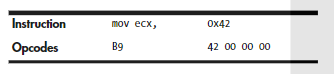
  * The 0x42000000 is treated as 0x42 as x86 architecture used the little endian format
    * Endianness of data describes whether the most significant byte or least significant byte is ordered first within a larger data item. For example:
      * 127.0.0.1 will be represented as 0x7F000001 in big endian but 0x0100007F in little endian.
      * Need to be cognizant of endianness to prevent reversing the order of important indicators such as ip addresses
* ### Operands
  * Used to identify the data used by an instruction
  * Three types
    * Immediate
      * Fixed values
    * Register
      * Registers such as ecx
    * Memory address
      * Memory address that contains the value of interest typically denoted by a value/registers/equation between brackets such as [eax]
* ### Registers
  * Small amount of data storage available to the CPU
  * Contents can be accessed more quickly than storage available elsewhere
  * x86 processors have a collection of registers available for use as temporary storage or workspace.
  * 4 categories
    * #### General registers
      * Used by the CPU during execution
      * 32 bits in size
      * X is lower 16 bits of the register
      * L is lowest 8 bits while H is the second set of 8 bits
      * 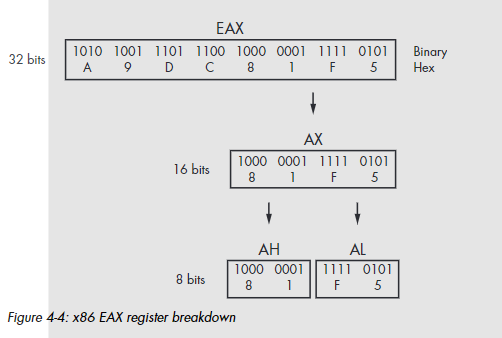
      * Some instructions uses specific registers
        * EAX and EDX is always used for multiplication and division
      * Used in a consistent fashion throughout a program
        * Known as a convention
        * Need to know to examine code more quickly.
        * For example when EAX used after function call, probably can tell that program is manipulating return value
    * Segment registers
      * Used to track sections of memory
    * #### Status flags
      * Used to make decisions
      * 32 bits in size, each bit is a flag
        * Either set or cleared
      * Used to control CPU operations or indicate the results of a CPU operation.
      * Important flags for malware analysis
        * ZF (Zero Flag)
          * Set when result of an operation is equal to zero aka cleared
        * CF (Carry Flag)
          * Set when the result of an operation is too large or too small for the destinaton operand otherwise it is cleared
        * SF (Sign Flag)
          * Set when the result of an operation is negative or cleared when the result is positive
          * Also set when the most significant bit is set after an arithmetic operation
        * TF (Trap Flag)
          * Used for debugging
          * Execute only one instruction at a time if this flag is set
    * #### Instruction pointers
      * Keep track of next instruction to execute
      * Called the EIP
      * If corrupted, CPU will not be able to fetch legitimate to execute, causing program to crash
      * If controlled, can be used to control the CPU
  * 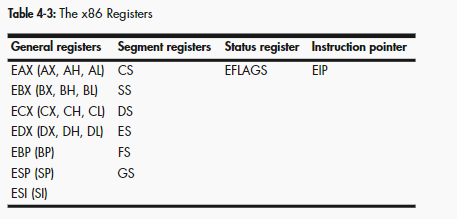
* ### Simple Instructions

  * mov
    * used to move data from one location to another
    * Reads and write memory
    * Move data into registers/RAM
    * Syntax
      * mov destination, source (intel syntax)
    * 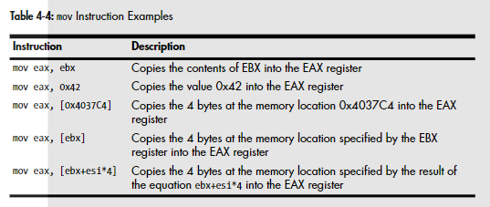
    * Operands surrounded by brackets are treated as memory references to data
    * Using an equation to calculate memory address saves space as shown in the last example.
      * Must use brackets, else considered invalid
  * lea
    * Stands for load effective address
    * Similar to mov
    * Syntax
      * lea destination, source
      * lea eax, [ebx+8]
        * Places the memory address specified by EBX+8 into eax   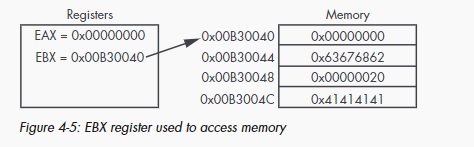
    * Also can be used when calculating values
      * Uses fewer instructions

* ### Arithmetic
  * sub
    * Subtracts
    * Modifies zero flag and carry flag
      * ZF if result is 0
      * CF if result is < 0
    * Syntax
      * sub destination, value
  * add
    * Adds
    * Syntax
      * add destination, value
  * inc
    * Increments a register by 1
    * Syntax
      * inc destination
  * dec
    * Decrements a register by 1
    * Syntax
      * dec destination
  * 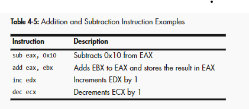
  * mul
    * Multiplies eax by value
    * Syntax
      * mul value
    * Result is stored across EDX and EAX
      * EDX is the most significant 32 bits
      * EAX is the least significant 32 bits
      * 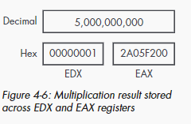
  * div
    * Divides edx:eax by value
    * Syntax
      * div value
    * Result is stored in EAX
    * Remainder is stored in EDX and can be retrieved with the modulo opertion
  * imul/idiv
    * Signed versins of mul and div
  * 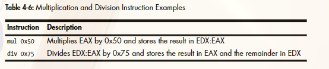
  * or and xor
    * logical operatons
    * syntax
      * xor/and/or destination, source
    * xor is being used to clear a register
      * xor eax, eax is more efficient way compared to mov eax, 0 because it takes up lesser space
  * shr shl
    * used to shift registers
    * Syntax
      * shr/shl destination count
    * shift bits in destination operand by right and left respectively by count
  * ror/rol
    * Circular shift
      * bits that fall off will be rotated to the other end
      * least significant to most significant for ror
      * most significant to least significant for rol
  * Shifting Used in placed of multiplication for optimization
    * simpler and faster
    * Does not need to set up registers and move data around
    * When shr/shl eax x is used, it means eax x 2x
    * Excessive use probably means encryption/compression
  * #### NOP
    * Does nothing
    * Goes to next instruction when issued
    * Used for NOP sled to prevent buffer overflow
      * Provides execution padding
      * Reduces risk malicious shell code will start executing in the middle
* ### The Stack
  * Stores memory for functions, local variables and flow control
  * Characterized by pushing and popping items off
  * Is a last in, first out structure
    * If 1,2 is pushed followed by 3, 3 will be popped off first since it was the last item pushed onto the stack
  * Registers used in a x86 architecture will be ESP and EBP
    * ESP
      * Stack pointer
      * Contains memory address that points to top of the stack
      * Value changes as items are pushed and popped of the stack
    * EBP
      * Base pointer
      * Stays consistent within a given function
      * Used as placeholder to keep track location of local variables and parameters
  * Stack instructions
    * push
    * pop
    * call
    * leave
    * enter
    * ret
  * allocated in top*down format in memory
    * higher addresses are used first
  * Used for short term storage only
  * Primarily used for management of data exchanged between function calls which varies among compilers
    * Normally referenced relative to EBP
  * #### Function Calls
    * Functions are portions of code within a program that perform a specific task and relatively independant of the remaining code
    * Main code *> function *> main code
    * Functions contains (cdecl convention):
      * Prologue
        * Few lines code at the start of function
        * Prepares stack and registers for use within the function
      * Epilogue
        * Restores stack and registers to the state before function is called
    * Common implementation for function calls
      * 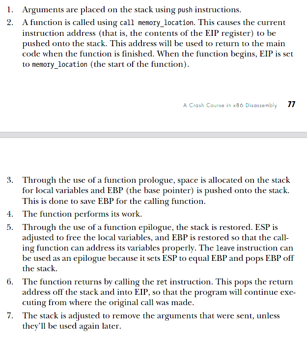
    * #### Stack Layout
      * Top down fashion
      * New stack frame generated every time call is performed
      * Each function maintains own stack frame until it returns
        * Caller's stack frame restored
        * Execution transferred back to caller
      * 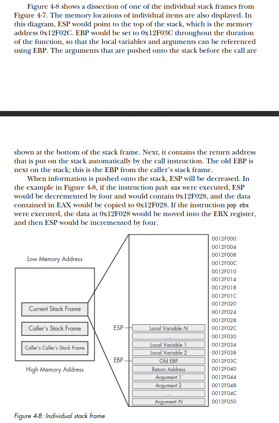 
      * Can read stack with mov
        * mov eax, ss:[esp]
          * will directly access top of stack
          * like pop eax but ESP register will not be affected
      * pusha
        * Pushes 16 bit registers on the stack in the following order
          1. AX
          2. CX
          3. DX
          4. BX
          5. SP
          6. BP
          7. SI
          8. DI
      * pushad
        * Pushes 32 bit registers on the stack in the following order
          1. EAX
          2. ECX
          3. EDX
          4. EBX
          5. ESP
          6. EBP
          7. ESI
          8. EDI
      * pushad and pusha are used when someone wants to save current state of registers to restore at a later time
        * Good indicator of hand coded assembly/shellcode as compilers dont usually use these instructions
  * ### Conditionals
    * Does comparison
    * test
      * Identical to and operator
      * Does not affect operands 
      * Only sets the zero flag
      * Normally used to test something against itself to check for null values
        * test eax, eax
    * cmp
      * Identical to sub operator
      * Does not affect operands
      * Sets zero or carry flag depending on result of the operation 
      * 
  * ### Branching
    * A branch is a sequence of code that is conditionally executed depending on the flow of the program
    * Used to describe the contro flow through the branches of the program
    * jmp
      * Unconditonal jump
        * Execution will always transfer to the specified location
    * if statements in a code are represented by conditional jumps
      * uses flags to determine whether to jump or to proceed to next instruction
    * 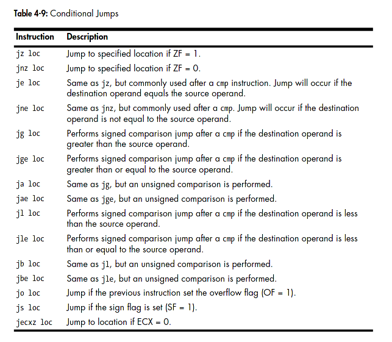
  * ### Rep Instructions
    * Used for manipulating data buffers
    * Usually in the form of an array of bytes
    * Can also be singly or double words
    * Most common data buffer manipulation are movsx, cmpsx, stosx and scasx where x=b/w/d for byte, word or double word.
    * movsb
      * Used to move a sequence of bytes from one location to another 
      * rep prefix commonly used with it to copy a sequence of bytes
        * Size is determined by ECX\
        * rep movsb is basically memcopy in C
      * Grabs bytes at address ESI, stores it at address EDI according to the setting of the direction flag
        * If 0, they are incremented
        * Otherwise decremented
    * cmpsb
      * Used to compare two sequences of bytes to determine whether they contain the same data
      * Subtracts the value at location EDI from the value at ESI and updates the flags and then increments ESI and EDI registers by one
      * Typically used with repe prefix
        * Will compare each byte of the two sequences until it finds a difference between the 2 sequences or reaches the end of comparison
        * ECX is checked together with the flags
          * If ZF/ECX = 0 operation will stop
        * Same as memcmp in C
    * scasb
      * Used to search for a single value in a sequence of bytes
      * Value is defined in the AL register
      * Similar to cmpsb
        * But compares byte located at ESI to AL
      * With repe will continue until the byte is found or ECX = 0.
      * If found, ESI will store location of the value
    * stosb
      * Used to store values in a location specified by EDI
      * Identical to scasb
        * Instead of searching, specified byte is placed in the location specified by EDI
      * rep prefix is used with stosb to initialize a buffer of memory
        * every byte will contain the same value
        * same as memset in C
    * 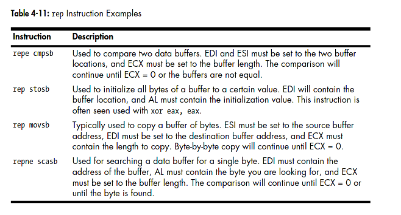   
  * ### C Main Method and Offsets
    * Malware usually written in C
      * Should learn how main method is being translated into assembly
      * Also will help with how offsets differ when going from C to assembly
    * Standard C program has 2 arguements for main method
      * int main(int argc, char** argv)
        * argc and argv are determined at runtime
        * argc is the number of arguements on the command line which includes the program name
        * argv is a pointer to an array of strings that contain the command-line arguements
    * 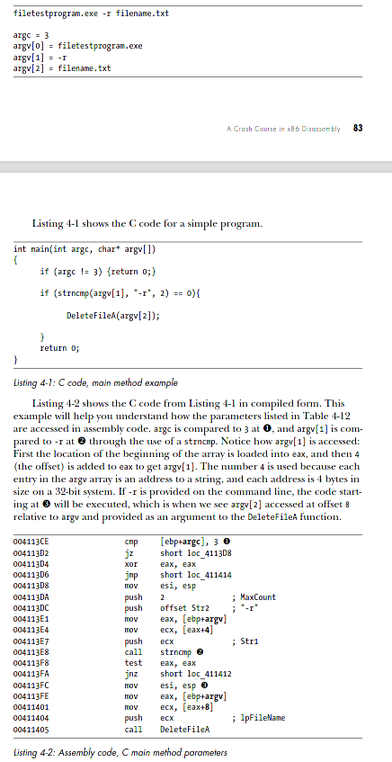