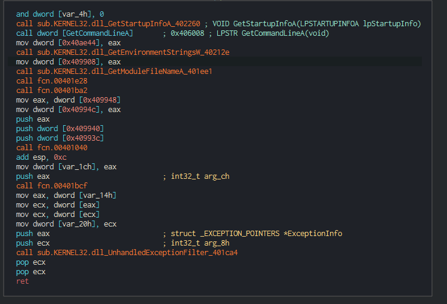
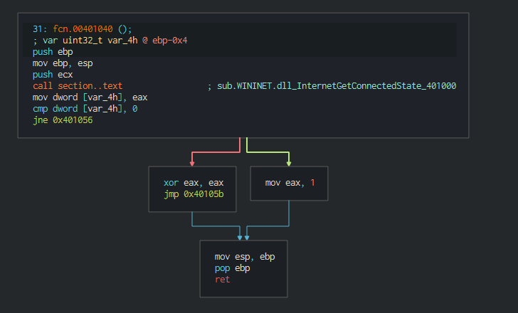
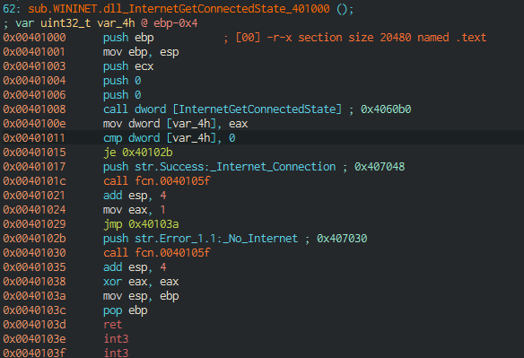
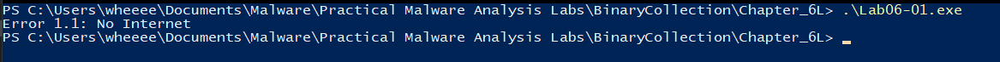

# Lab 6-1

1. Judging from the entry function, the main function is located at 0x00401040:

 
Here is the disassembly of the main function: 

Judging from the graph of the main function, the return value of InternetGetConnectedState is being compared to 0, if yes, the program will end, if not the program will jump to address 0x401056. Hence, it can be deduced that the major code construct found in the main function is an if statement.

2. Here is the disassembly of InternetGetConnectedState which calls 0x40105F:

From here, it can be seen that strings are being pushed into the function located at 0x40105F. These strings which include strings such as "Success: Internet Connection\n" and "Error 1.1: No Internet\n" feels like they are supposed to be read by a person. Hence, I guess that the subroutine at 0x40105F is printf.

This can be confirmed with dynamic analysis where I run the executable and here's the result:

Here, it can be seen that the string found is being printed out, proving that the subroutine is printf.

3. This program bascially checks for an active Internet connection. If there is, it prints out "Success: Internet Connection\n" else, if prints out "Error 1.1: No Internet\n".