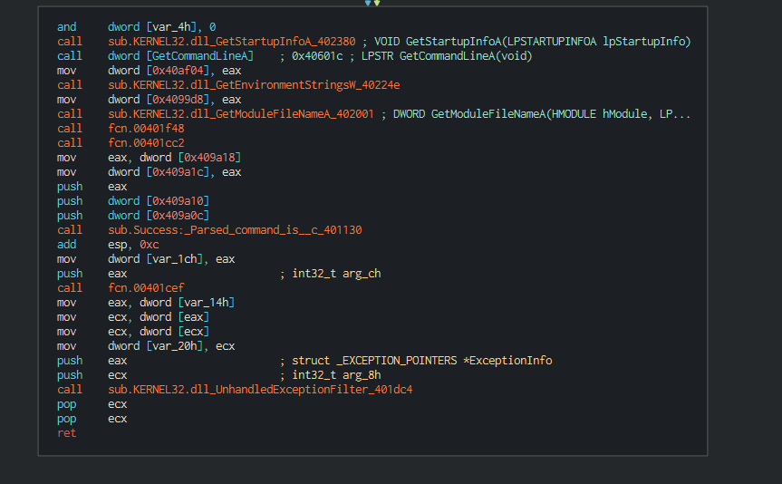
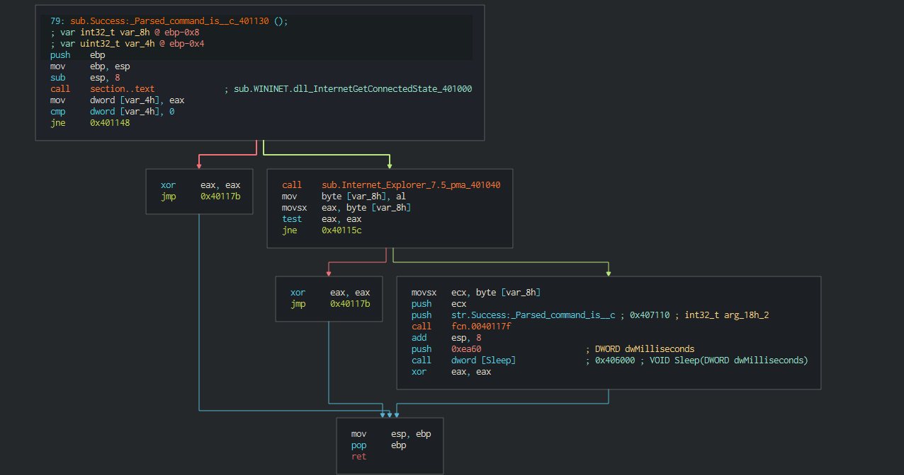
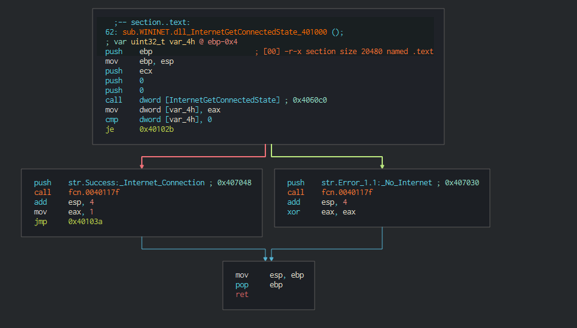
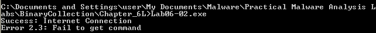
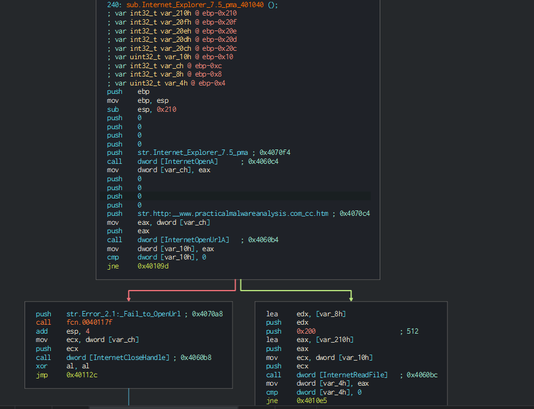
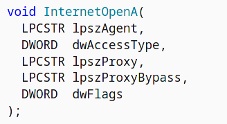
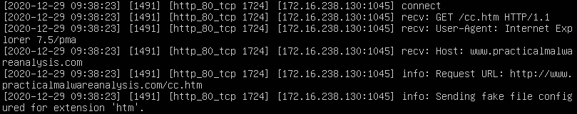
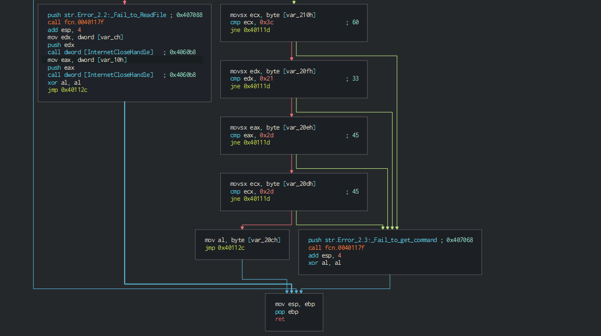

# Lab 6-2

1. Upon disassembling the entry function, i deduce that the main function is located at 0x401130

    

    Heres the disassembly of the main function: 

    

    The first subroutine called is InternetGetConnectedState which prints whether the computer is connected to the Internet or not. If yes, "Success: Internet Connection\n" . Else, "Error 1.1: No Internet\n" is printed.

2. Here is the InternetGetConnectedState function:

    

    Here, it can be seen that either "Success: Internet Connection\n" or  "Error 1.1: No Internet\n" is being pushed into the function. When the program is run, either of these strings will be printed out. Hence, the subroutine at 0x40117F is printf.

    

3. This is the disassembly of the second subroutine:

    

    In this part, 2 strings are being used as parameters for two functions.

    First string, which is "Internet Explorer 7.5/pma" is being passed into function InternetOpenA.

    Here is the documentation of this function:

    

    From here, it can be deduced that "Internet Explorer 7.5/pma" will be the user agent used.

    Second string is "http://www.practicalmalwareanalysis.com/cc.htm" which is pushed into InternetOpenURLA which means that the program connects to this url

    These information can be confirmed by listening on a server running INetSim:

    

    If an error occured, the string "Error 2.1: Fail to OpenUrl\n" will be printed, else the html send from the server will be read

    Here's the second part of the disassmebly:

    

    Here it shows that it compares characters at with 0x3c, 0x21, 0x2d and 0x2d which corresponds to <!--. 
    If any of them fails, "Error 2.3: Fail to get command\n" will be printed. It prob means that the program will try to grab a command at the top of the file which is a comment in the html file

4. The subroutine used is an array which is denoted by:
    ```
    0x004010e5      movsx ecx, byte [var_210h]
    0x004010ec      cmp ecx, 0x3c      ; 60
    0x004010ef      jne 0x40111d
    0x004010f1      movsx edx, byte [var_20fh]
    0x004010f8      cmp edx, 0x21      ; 33
    0x004010fb      jne 0x40111d
    0x004010fd      movsx eax, byte [var_20eh]
    0x00401104      cmp eax, 0x2d      ; 45
    0x00401107      jne 0x40111d
    0x00401109      movsx ecx, byte [var_20dh]
    0x00401110      cmp ecx, 0x2d      ; 45
    0x00401113      jne 0x40111d
    0x00401115      mov al, byte [var_20ch]
    0x0040111b      jmp 0x40112c
    ```

5. A good network indicator is any http traffic with the user agent "Internet Explorer 7.5/pma" going to "http://www.practicalmalwareanalysis.com/cc.htm" coming from the host computer
6. The purpose of this program is to check whether if internet is available. If yes it get the webpage from "http://www.practicalmalwareanalysis.com/cc.htm" to receive commands. Else, the program ends.
