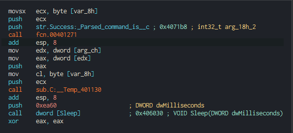
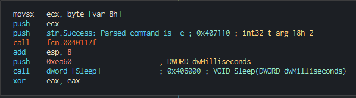
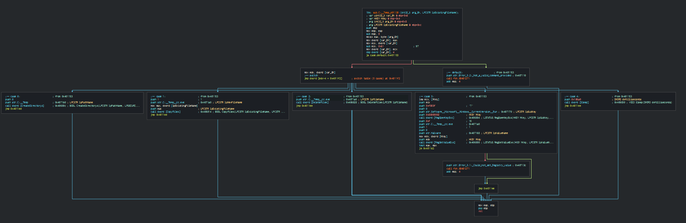
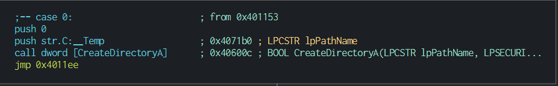
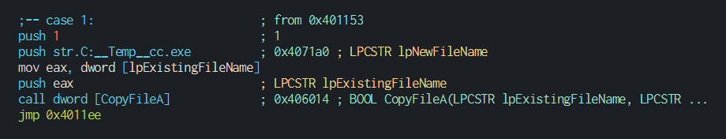
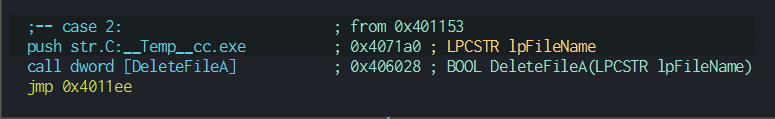
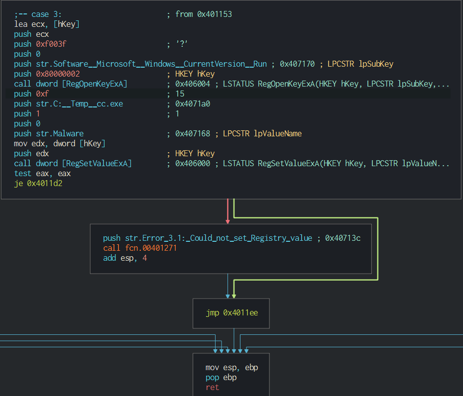
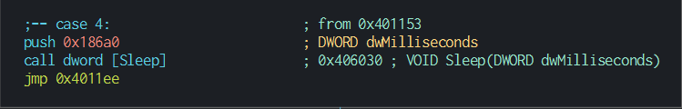

# Lab6-3

1. The main function in lab3 and lab2 is very similar except for this part:

    Lab 3:

    

    Lab 2:

    

    A new function is being called in lab 3 at address 0x401130

2. The function takes in 2 parameters:
* The command taken from the comment at the top of the html received from the website
* The arg array passed into the main function

3. Here is the graph of the new function:
    
    
    By judging how the code flows, it can de deduced that a switch statement with a jump table is being implemented in this function

4. Now let's analyze each case of the function:
    1. Case 0:
   
        

        This will create a directory at C:\\Temp

    2. Case 1:
       
       

       This will create a file name cc.exe at C:\\Temp

    3. Case 2:
       
       

       This will delete C:\\Temp\\cc.exe
    
    4. Case 3:

       

       Here the registry key "Software\\Microsoft\\Windows\\CurrentVersion\\Run" is being opened and a new value of name "Malware" will be created with the path of the file created at case 1, effectively adding the executable to startup programs. If failed, "Error: Could not set Registry value" will be printed on the terminal
    
    5. Case 4:
       
       

       Sleep for 100000 ms or 100s

5. Good host indicators are a Malware value at Software\\Microsoft\\Windows\\CurrentVersion\\Run or the presence of C:\\Temp\\cc.exe
6. The purpose of this program is to check whether if internet is available. If yes it get the webpage from "http://www.practicalmalwareanalysis.com/cc.htm" to receive commands to either make a new directory "C:\\Temp" or create/delete a file "cc.exe" at "C:\\Temp", add cc.exe to startup prpgrams or cause the computer to sleep for 100s . Else, the program ends.