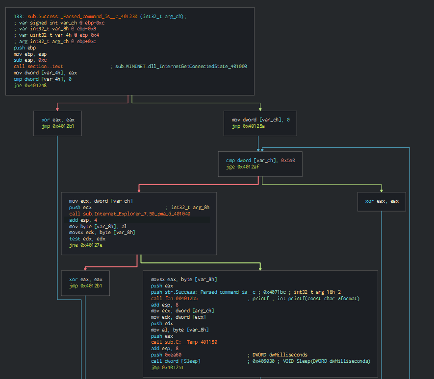
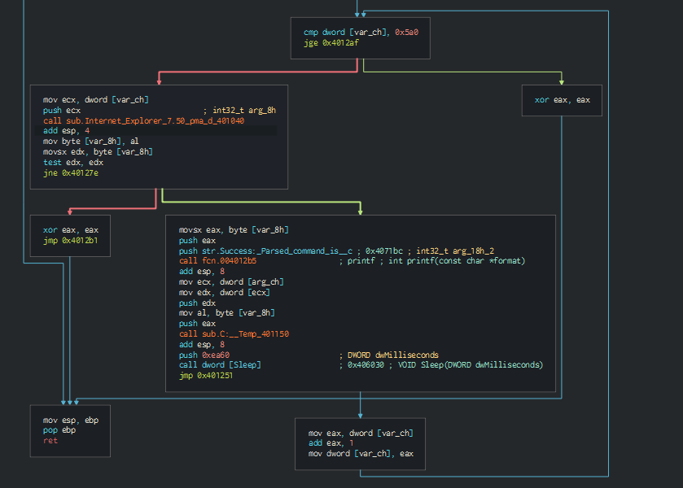

# Lab 6-4

1. In this program, the address for the functions are different. printf is at 0x4012b5, sub.C:__Temp_401150 is at 0x401150 and the main function is at 0x401230
   
2. A for loop has been added which loops the function sub.Internet_Explorer_7.50_pma_d_401040 1440 times.
   
3. This time the function sub.Internet_Explorer_7.50_pma_d_401040 accepts the integer. The integer passed into this function is the number of times this function has run. Inside the function, the user agent will be appended with the number of times the function has run which will be used to send the request to the server.
4. The program will be put to sleep 60 secs every repetition of the loop. The loop will run 1440 times. Hence, the program will run for at least 1440 mins or a day if there is an active Internet Connection.
5. The User agent used will be different which will be in the format "Internet Explorer 7.50/pma%d" where %d will be the number of times the function has run. Another possible indicator will be that there will be multiple connections to the remote host at an interval of 60 secs for 1440 times.
6. The purpose of this program is to check whether if internet is available. If yes it get the webpage from "http://www.practicalmalwareanalysis.com/cc.htm" 1440 times to receive commands to either make a new directory "C:\\Temp" or create/delete a file "cc.exe" at "C:\\Temp", add cc.exe to startup prpgrams or cause the computer to sleep for 100s. Then the computer will sleep for 60 secs before running the loop again. Else, the program ends.
