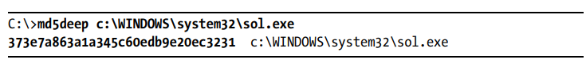
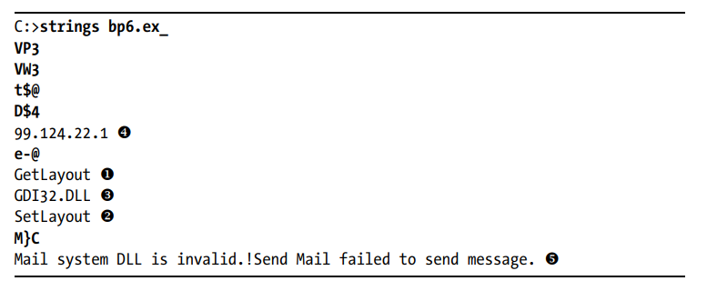
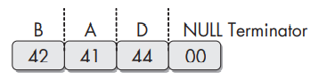
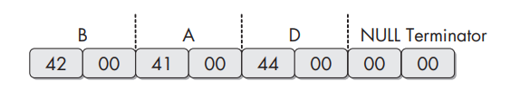
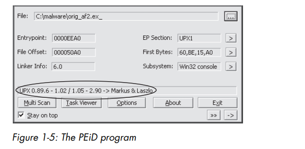
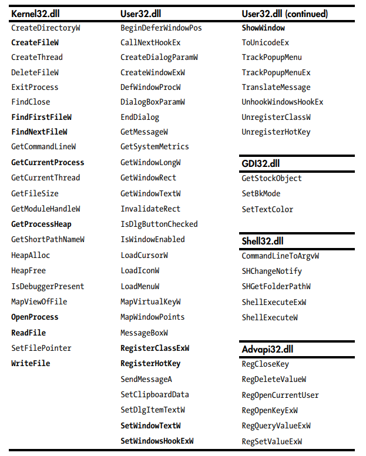

# Chapter 1: Basic Static Techniques
<br>

**Static Analysis** : process of analyzing code or structure of a program to determine its function

Ways to get useful information from executables:
* Use AV to confirm maliciousness
* Using hashes to identify malware
* Gleaning information from a file's strings, functions and headers

## Antivirus Scanning
* Can identified malware that has been detected before
* AV mainly detects malware using file signatures/heuristics (behavioral/pattern-matching analysis AKA dynamic analysis)
* Not reliable
    * Malware authors can modify code to change the file signature
    * Heuristics can be bypassed by using new and unique malware
* Virustotal good place to submit files to check for malware
    * Can run several antivirus against the file as different av use different databases and heuristics
    * Will generate a report containing name and additional information about the malware

## Hashing 
* Common method to uniquely identify malware by running malware through a hashing program
    * MD5/SHA1 hash of the file formed
* Can get it through windows WINMD5 calculator to display hashes for serveral files at a time or cli tools such as md5deep/md5sum
* Hash is used for:
    * Labeling a malwre
    * Sharing with other analysts to help them identify the malware
    * Search online to check if the malware has already been identified



Figure 1.1: MD5 hash for Solitaire generated from md5deep

## Finding Strings

* A program will contain strings if it:
    * Prints a message
    * Connects to a url
    * Copies/create/edit a file to a specific localtion
* A simple way to guess what the program does
    * What file is changed
    * Which website does the program connect to
* Strings is normally used to search for strings in a program
    * Usage:
        ```
        pikachu@localhost:~$ strings *filename
        ```
    * Ignores context and formatting
        * Can analyze any file type and detect strings across an entire file
    * Searches for >3 letters or greater sequence of ASCII/Unicode characters, followed by a string termination character
    * However, sometimes Strings picks up "strings" that are not actually strings  
        * Could be a memory address/CPU instructions/data used by program
            * Up to user to filter invalid strings
        * Usually obvious as not legitimate text
    * Eg:

    

    * In this image the bolded strings can be ignored. Strings that are short and doesnt look like a word are probably meaningless
    * GetLayout,SetLayout are probably part of the Windows Graphics Library
        * Begin with a capital letter for for the first letter and subsequent notes
    * GDI32.DLL is a Windows DLL used by graphic programs
    * 99.124.22.1 is a ip address which is accessed by the program
    * The last one is a error message. This error message provides two information:
        * The program probably sends informaton through mail and depends on a mail system dll
        * Can try to look at email logs for suspicious traffic
    * DLLs are usually not malicious but are frequently used by malware anyways
    
* Can be stored in 2 ways:
    * Ascii
        * 1 byte/8 bits
        * Eg: BAD is stored as:

        
    * Unicode
        * 2 bytes/16 bits
        * Eg: BAD is stored as:

        
    * Both format ends with a null terminator

## Packed and Obfuscated Malware

* Packing and obfuscating are used to make files more difficult to detect/analyze
* Obfuscated programs  is where malware authors attempts to hide execution of their program
* Packed programs is a subset of obfuscatied programs where the malware author compresses the malicious program to prevent static analysis
* Can be easily identified using Strings as they usually contains only a few strings
* Needs more than static analysis in order to analyse the file

### Packing Files

When packed program is run, wrapper program runs to decompress the packed file and then run the unpacked file.
* When analysed statically, only small wrapper program can be dissected
* Packers can be detected using PEiD which will find out if a file is packed and in most of the cases, identify which packer is being used by program
    * However, PEiD is susceptible to attacks by malware themselves through vulnerabilities being executed and then execute the malware itself
    
    

    Figure of PEiD recognising a program using the UPX packer


## Portable Executable File Format
* Used by Windows Executables, Object code and DLLs. 
* A data structure that contains information necessary for Windows loader to manage the wrapped executable code.
* Usually begin with header which contains
    * Type of application
    * Required library functions and space requirements
* The header is very important when it comes to analysing malware

## Linked Libraries and Functions
* Information can be retrieved from programs using the list of imported functions
    * Imports are functions used by one program that are stored in another program
        * Connected by linking 
        * Used to prevent reimplementing functionality in multiple programs 
        * Linked statically or dynamically or at runtime 

### Static linking 
* Least commonly used method of linking libraries
    * Common in UNIX and Linux programs though.
* Copies code to the executable 
    * Executable will grow in size
* Hard to differentiate between statically linked libraries code compared to actual code as PE file headers doesnt show it

## Runtime linking 
* Use freqeuently in packed malware 
* Programs only connect to libraries when that function starts

## Dynamic Linking
* Some Windows function allow importing of linked functions not listed in a program's file header
    * LoadLibrary and GetProcAddress
        * allow programs to access any function  in any library on the system
            * Cannot tell statically which functions are being linked to by the suspect program
    * LdrGetProcAddress
    * LdrLoadDll
* Most common and interesting
* Host OS searches for the necessary libraries when the program is loaded
* PE file header stores information about every library that will be loaded and every function that will be used by the program
* The most important part of a program and important to identify them
* For example if program imports the function, URLDownloadToFile, the program probably will connect to the Internet and download content to store in a file

## Exploring Dynamically Linked Functions with Dependancy Walker
* Dependancy Walker lists only dynamically linked functions in an executable
* Common DLLs imported by executables:
    * Kernel32.dll
        * Contains core functionality such as access and manipulation of memory,files and hardware
    * Advapi32.dll
        * Provides access to advanced core Windows components such as the Service Manager and Registry
    * User32.dll
        * Contains all user-interface components such as buttons, scrollbars and components for controlling and responding to user actions\
    * Gdi32.dll
        * Contains functions for displaying and manipulaing graphics
    * Ntdll.dll
        * Interface to Windows Kernel
        * Normally not imported directly though it is imported indirectly when importing Kernel32.dll
        * If imported directly, program is trying to use functionality not normally available to Windows Programs
            * Examples included are hiding functionality or manipulating processes
    * WSock32.dll/Ws2_32.dll
        * Networking DLLs. Program that accesses it is likely to connect to a network or perfoms network-related tasks
    * Wininet.dll
        * Contains higher level networking functions that implement protocols such as FTP/HTTP/NTP
* Functions that end in ex normally is an updated one from the old one. Functions that have 2 updates will have 2 ex at the end of the name
* Functions that take in a string parameter normally includes an A or W at the end of their names such as CreateDirectoryW
    * The A/W will not be used in the Microsoft Documentation

## Imported Functions
* PE file header also includes information about specific functions used by an executable
* Names of these Windows functions can give an idea about what the executable does
* Go look at Windows Documentation for Windows API

## Exported Functions 
* Exported functions are used by DLLs and Exes to interact with other programs and code
* Functions that a program exports can be found in the PE file header
* More commonly found in DLLs compared to exes
    * As DLLs are specifically implemented to provide functionality for Exes
    * Since Exe do not need to provide functions for other programs, exported functions are rare
        * If Exes export function though, that function can provide useful information about a malware
* Names of exported functions in malware are often omitted or misleading.

## Static Analyis in Practice

### PotentialKeylogger.exe
* Imports
    

    * A lot of imports can be seen, hence probably not packed
* Interesting imports
    * Kernel32.dll
        * Open and manipulate process
            * OpenProcess
            * GetCurrentProcess
            * GetProcessHeap
        * Open and manipulate files
            * ReadFile
            * CreateFile
            * WriteFile
    * User32.dll
        * GUI manipulation (not necessarily displayed to user)
            * RegisterClassEx
            * SetWindowText
            * ShowWindow
        * Receive Keyboard inputs from user
            * SetWindowsHookEx
        * Notifies when users pressed a specific hotkey application
            * ResgiterHotKey
                * Brings user to the application when hotkey is pressed
    * GDI32.dll confirms that the program has a GUI
    * Shell32.dll confirms that the program can launch other programs 
        * Common feature for both malware and legitimate programs
    * Advapi32.dll
        * Program uses the registry
        * When this appears, should look for strings that look like registry keys
            * eg:  Software\Microsoft\Windows\CurrentVersion\Run
* Exports
    * LowLevelKeyboardProc/LowLevelMouseProc
        * Used with SetWindowsHookEx 
        * Specifies which function to be called when an event occurs

* Conclusion
    * This programs uses SetWindowsHookEx to record keystrokes
    * This program has a GUI displayed to a specific user and has the hotkey registered with RegisterHotKey
        * Using the hotkey will launch the GUI and display the recorded keystrokes
    * By altering the value of Software\Microsoft\Windows\CurrentVersion\Run, this program sets itself to load at system startup 

## PackedProgram.exe
* Imports
    

    Imports are little + no readable strings, telling us that the program is packed/obfuscated.
* Need more advanced techniques such as dynamic analysis/unpacking the program to get more information from the program

## PE File Headers and Sections
* Contains metadata about the file itself. After the header comes the actual sections of the file, each which contains useful information

* Common/Interesting sections in a PE file
    * .text
        * Contains instuctions that the CPU executes.
        * Only section that can be executed and should be the only one
    * .rdata
        * Contains the import and export information, which can be seen using Dependancy Walker and PEview.
        * Can also contain other read only data used by the program
        * A program can also contain .edata/.idata which store the import/export information
    * .data
        * Contains the program's global data accessible from anywhere in the program. Local data will not be stored here or anywhere in the program
    * .rsrc 
        * Includes the resources used by the executable that are not considered part of the executable such as icons,images,menus and strings.
        
### Examining PE Files with PEview
* Can use PEview tool to browse through the information
* Compile time can be faked by malware authors
* IMAGE_DOS_HEADER, MS-DOS Stud Program and IMAGE_NT_HEADERS can be ignored
* IMAGE_FILE_HEADER contain basic information of the file
* IMAGE_OPTIONAL_HEADER 
    * Subsystem description will show whether the program is a console/GUI program
        * IMAGE_SUBSYSTEM_WINDOWS_CUI -> Console
        * IMAGE_SUBSYSTEM_WINDOWS_GUI -> Graphical
* IMAGE_SECTION_HEADER 
    * Describe each section of a PE file
    * Sections names are generally consistent across all executables
    * Virtual Size tell how much space is allocated for a section during the loading process
    * Size of Raw data tells how big is the section on disk
        * If virtual size > raw data by a lot, packed executable, especially for .text
            * .data is normal for virtual size to be larger

### Viewing resource secton with Resource Hacker
* Can use Resource Hacker to view resources in an executable
    * Icon section lists images shown when the executable is in a file listing
    * Menu section stores all menus that appear in various windows
        * Contains names of all menus and the text also
            * Can get functionality from the names
    * Dialog section contains program's dialog menus
    * String Table section stores strings
    * Version Info section contains version number, company name and copyright statement

## Summary 
* Imports -> Functions from other libraries used by the program
* Exports -> Functions in the malware that are meant to be called by other programs or libraries
* Time Date Stamp -> Time when the program was compiled
* Sections Names of sections in the file and their sizes on disk and in memory
* Resources -> Strings, icons, menus and other information included in the file