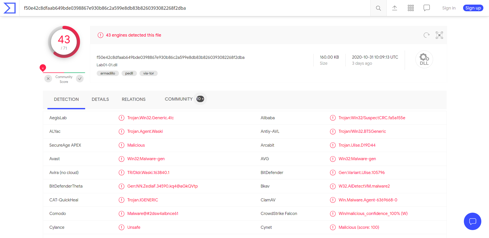
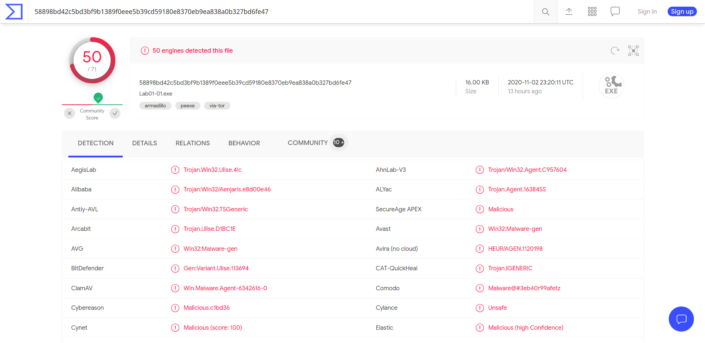
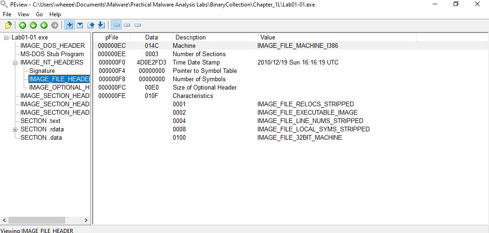
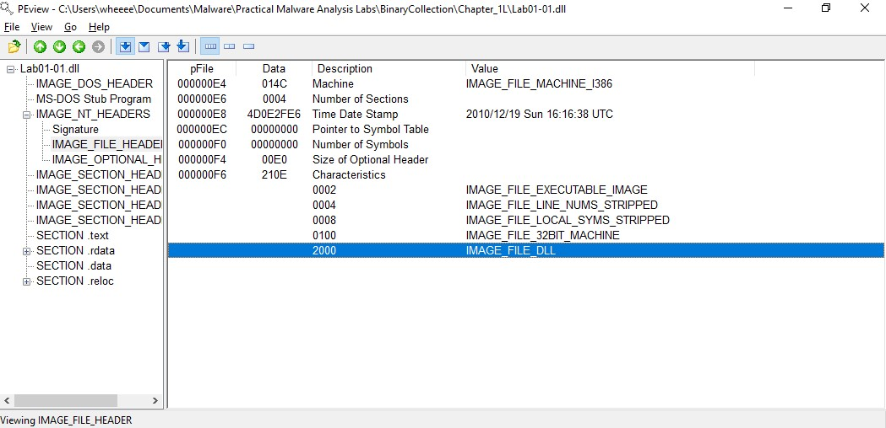
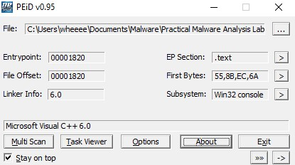
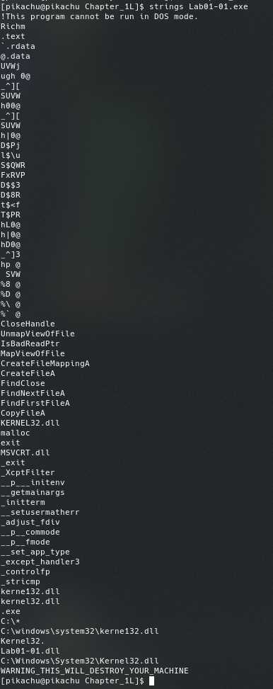
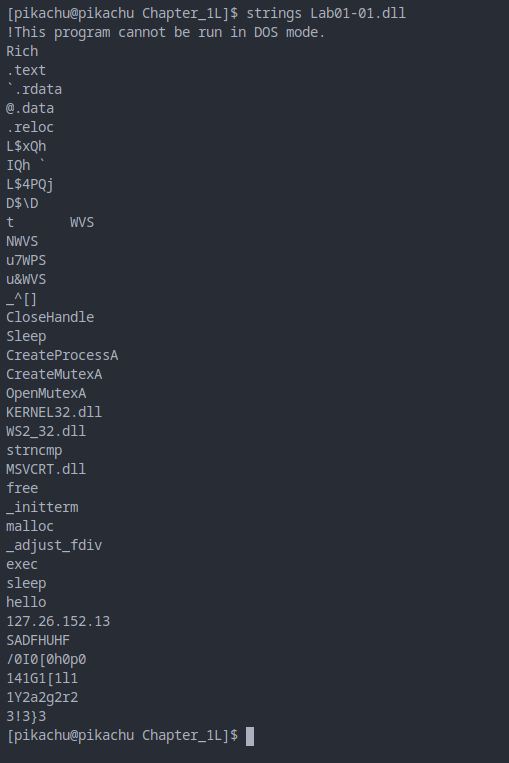

# Lab 1-1

1. Using VirusTotal, I found out that numerous antivirus have flagged out Lab1-01.dll and Lab1-01.exe as a Trojan.
   
    
    

2. Lab1-01.exe is compiled on 2010/12/19 Sun 16:16:19 UTC while Lab1-01.dll is compiled on 2010/12/19 Sun 16:16:38 UTC, indicating that they might be related due to the similar compile time.
   
    
    

3. When put into PEiD, the program shows that the file was compiled by Microsoft Visual C++ 6.0.0, indicating that the file is not packed.
   
    

4. The dll imports KERNEL32.DLL, which is mainly used for file, memory and hardware manipulation, ws2_32.dll which is used for networking while the exe also imports msvcrt.dll which ships in the standard C library functions.
    Imports for the exe:

     

    Imports for the dll:
    
     

5. Through using strings, I found a string named Kerne132.dll and Kernel32.dll in Lab1-01.exe. It is possible that the program creates a new dll named Kerne132.dll using the CopyFileA function to copy Lab1-01.dll to become Kerne132.dll at system32. So to confirm infection, one can try to find the file Kerne132.dll in the System32 directory.

    

6. Through using strings, I found a string with the value "127.26.152.13" which is an ip address. So for a network based indication, one can try to monitor the network traffic from the affected device to check for packets traveling to that ip address.
   
   

7. Using all the information gathered, I think that the program first injects a malicious dll into the victim's computer and then calls that dll to execute the function inside the dll and communicate with 127.26.152.13 to either get instructions from a C2 server or send information to that ip address which is basically a trojan or a backdoor.
